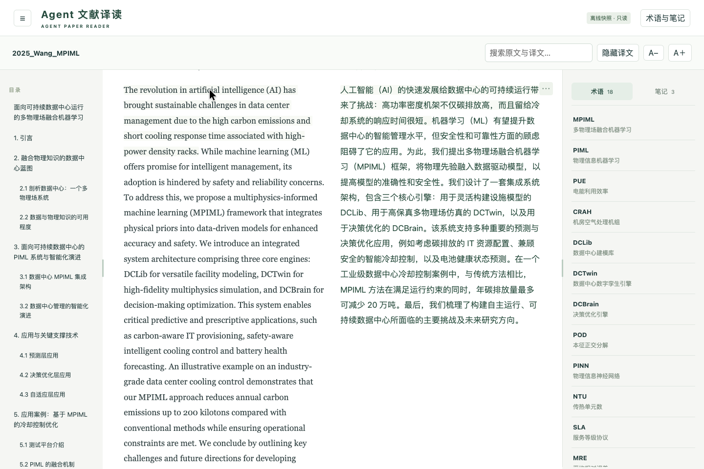
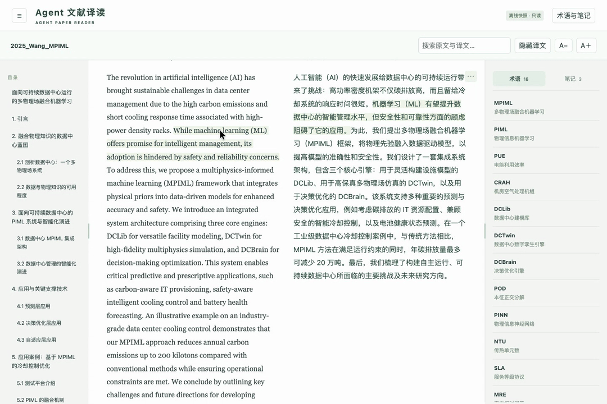
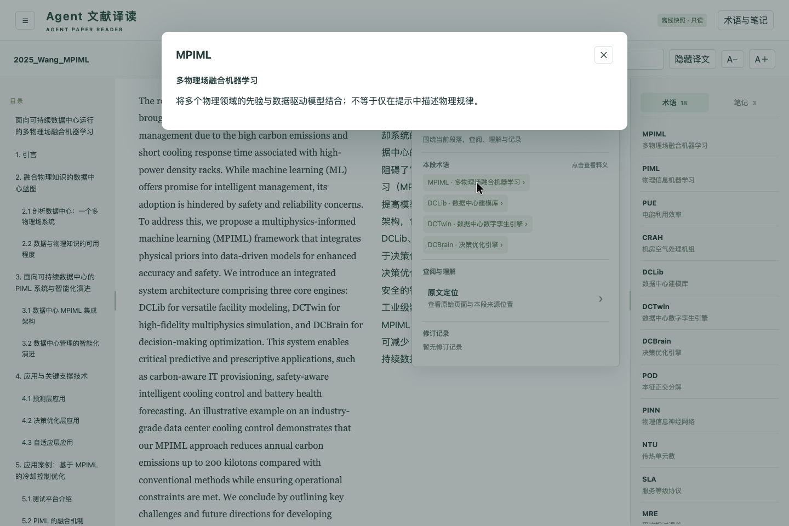
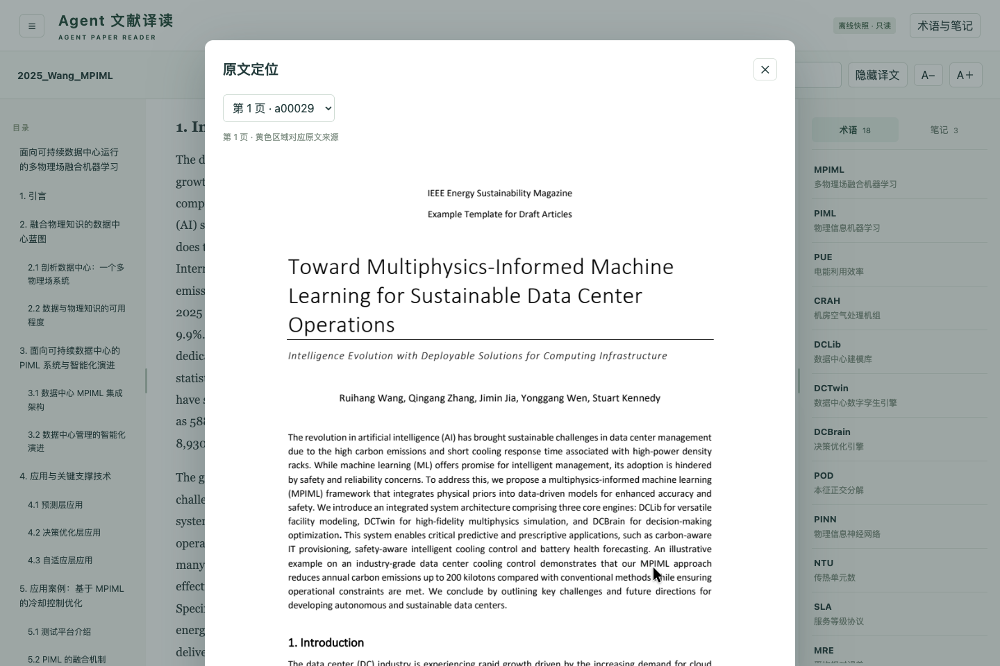
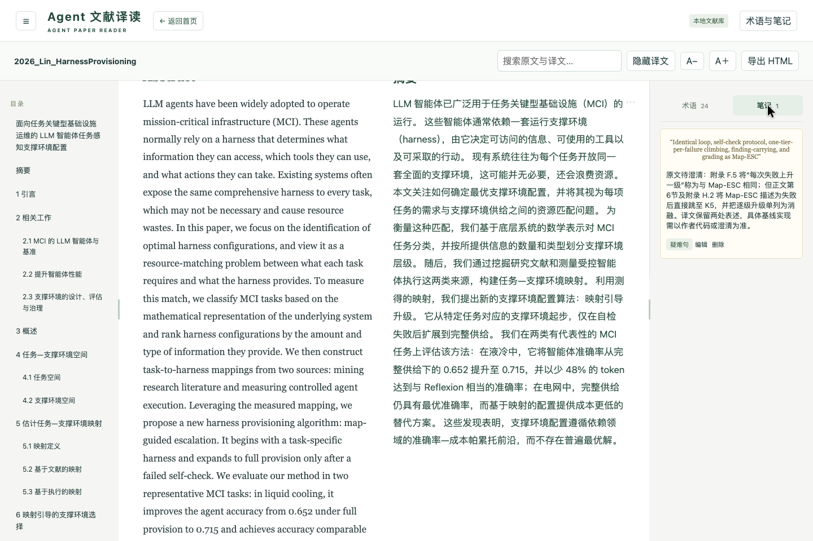
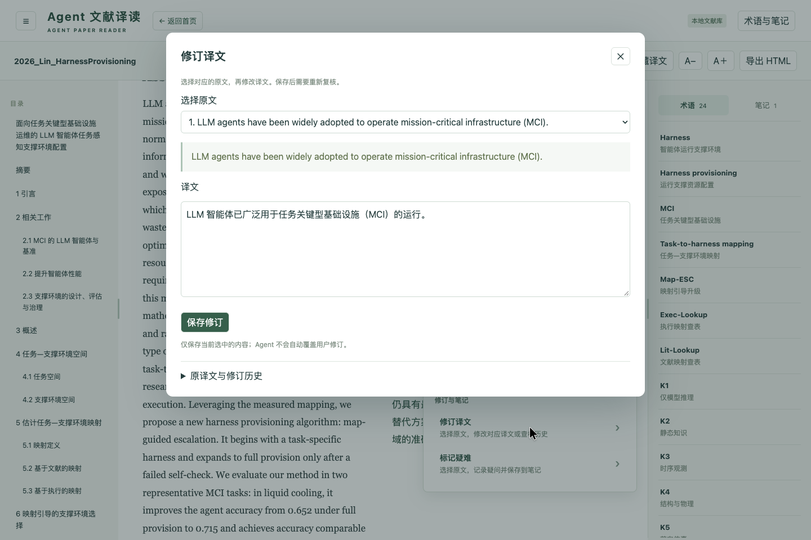

<div align="center">

# Agent 文献译读
### Agent Paper Reader

**把英文文献与文章交给你的 Agent，把原文、译文和理解留在同一个阅读界面。**

简体中文 · [English](README.en.md)

[实机演示](#实机演示) · [开始使用](#开始使用) · [功能示例](examples/reading-showcase.html) · [本地文献库](references/library.md)

</div>



一个以 **Skill** 交付的英文文献与文章精读工具。由你当前使用的 Agent 理解全文上下文、翻译、整理术语并复核，生成一份可独立打开的双语 HTML。**默认无需启动服务，也不需要额外配置翻译 API Key。**

当前源码面向 **英文原文 → 简体中文**，输入支持文字型 PDF、Markdown、纯文本、本地 HTML、Word (.docx) 与单文件 LaTeX (.tex)。需要长期管理文献、划线笔记和修订译文时，再开启随包提供的本地文献库。

## 适合读什么

论文、研究报告、技术文档、行业分析和普通英文文章，都可以使用同一套对照阅读流程。处理时保留原文结构，不要求内容具有论文格式。

六种格式使用同一套结构整理、翻译、语义对齐、第二轮复核和 HTML 导出流程：

| 原始文档 | 文件类型 | 处理范围与边界 |
| --- | --- | --- |
| 文字型 PDF | `.pdf` | 提取文本并保留原页供核对；扫描件不做 OCR。 |
| Markdown | `.md` / `.markdown` | UTF-8 文本，保留标题、列表、表格和代码；本地图像需与文档一起提供。 |
| 纯文本 | `.txt` | UTF-8 文本，按空行整理候选段落。 |
| 本地网页存档 | `.html` / `.htm` | 解析文本结构；只复制文档同目录的相对本地图像，不抓取网址或远程图。网页导航、页脚需由 Agent 在结构阶段核对。 |
| Word | `.docx` | 支持普通正文、标题、表格、常见公式、上下标及嵌入图像；复杂页眉页脚、文本框、修订和一般 OLE 对象支持有限。部分 EMF 嵌入图需要下方的可选依赖。 |
| 单文件 LaTeX | `.tex` | 处理主文件中的正文、标题、公式和代码；不展开 `\input` / `\include`，不编译，也不载入外部 `.bib` / `.bbl`。`\includegraphics` 缺图会保留问题，需核对补齐。 |

网页文章先保存为本地文件再交给 Agent。本版不做 OCR，不支持 EPUB 或其他语言方向；提取后的内容仍需 Agent 结合原件整理和复核。

## 实机演示

下面使用两篇已处理论文录制，展示实际界面与操作。

### 一边读，一边对照

悬停一句，中英对应内容一起轻亮；点击保留高亮，再点一次取消。操作按钮收在段落的「…」中，让正文保持连续。



**[观看完整操作视频 · 42 秒 MP4](docs/media/reader-demo.mp4)**：句子联动 → 本段术语 → 原文定位 → 切换论文 → 复核笔记 → 译文修订。GitHub 若不直接播放，可下载观看。

### 术语有上下文，译文有出处

| 理解本段术语 | 回到 PDF 原页核对 |
| --- | --- |
|  |  |
| 从段落「…」查看相关术语，结合文献语境理解概念。 | 在阅读界面查看原页，核对版面、图表和原句。 |

### 需要记下来，再打开本地文献库

术语与笔记分为两个标签页。阅读中的疑难和复核记录留在论文旁边；译文修订可查看原句与历史。以下是第二篇论文的实机界面。



<details>
<summary>展开查看译文修订界面</summary>



</details>

截图与视频中的论文来源、录制范围见 [演示素材说明](docs/media/README.md)。仓库没有附带这两篇论文的全文或完整译稿。

## 它怎样工作

1. **交给 Agent**：提供文件路径和独立工作目录。
2. **理解与翻译**：Agent 检查提取结果与原页，整理结构、术语，完成翻译和语义对齐。
3. **复核与校验**：Agent 进行第二轮复核；脚本检查来源覆盖、版本与数据完整性，支持中断续做。
4. **导出阅读**：获得单文件 HTML，打开即可对照精读。需要保存新笔记或修订，再启动本地文献库。

**Skill 负责工作流，Agent 负责理解与翻译，脚本负责确定性处理，HTML 负责阅读。** 导入文件本身不会自动调用模型；实际翻译仍由当前 Agent 执行，使用其会话额度。

## 开始使用

### 1. 把链接发给 Agent，让它帮你安装

复制下面这段话，发给你正在使用、具备本地文件和命令执行能力的 Agent：

```text
请帮我安装这个 Skill：
https://github.com/BananaSoldier01/agent-paper-reader

先阅读仓库 README 和 SKILL.md，从 main 分支当前源码安装完整 Skill。
按当前 Agent 支持的方式安装；请使用 v0.3.0 精简安装包或 main 源码，包含多格式输入及 Agent 工作流改进；不要使用仅含 PDF/Markdown 的旧版 v0.1.0。
请确认适合当前环境的安装目录，并检查 Python 3.12+ 等运行条件。
保留已有配置与文献数据，完成后告诉我安装位置、是否可用，以及如何开始处理文章。
```

Agent 可以获取仓库或发布包，并按当前环境完成安装检查。**不需要先手动下载、解压或查找文件夹。** 不同 Agent 的安装方式与权限要求可能不同；安装是否成功，以实际检查结果为准。

需要 **Python 3.12+**。首次初始化会联网安装独立依赖；日常使用不需要 Node，也不用构建前端。处理文献时，Agent 还需要具备页面查看能力。

<details>
<summary>Word 中部分 EMF 嵌入图的额外环境（可选）</summary>

要将这类矢量图自动转换成阅读页可显示的图像，本机还需具备：

- `PATH` 上的 `rsvg-convert` 或 Inkscape。Linux 的相关包为 `librsvg2-bin`；macOS 可使用 Homebrew 的 `librsvg`。
- `fontconfig` / `fc-match` 能识别 Times New Roman 或兼容字体，以及 OpenSymbol。Linux 可使用 `fonts-liberation` 或 `fonts-croscore`、`fonts-opensymbol`；不能仅凭任意回退字体存在就判断齐全。

运行 `doctor`，查看 `emf_preview.ready`、实际匹配的字体 family 和 `missing`。顶层 `ready` 只表示基础运行环境就绪，不保证 EMF 转图环境齐全。这些系统工具和字体不会由 Python 的 `setup` 自动安装。

字体文件已存在，也可能因 fontconfig 的搜索路径而未被识别。遇到回退字体时，可让 Agent 检查字体配置；若已有验证可用的配置文件，可通过进程级 `FONTCONFIG_FILE` 指定，并让 `doctor` 与执行导入的 CLI 或服务使用同一配置。若此前导入留下了缺图，修正环境后保留已有数据，在另建工作区从原 DOCX 重新导入验证；仅重导出不会重做转换。

缺少环境、转换失败或结果不可靠时，原始 EMF 和问题记录会保留，不能按已经恢复图片交付。这些额外组件只用于相关 Word 嵌入图，普通 PDF 等输入不要求它们。

</details>

<details>
<summary>手动安装与目录说明（可选）</summary>

需要本页所列多格式功能时，下载 [main 分支源码 ZIP](https://github.com/BananaSoldier01/agent-paper-reader/archive/refs/heads/main.zip)，解压后将完整源码目录放入你的 Agent 支持的 Skill 目录，并命名为 `agent-paper-reader`。

[v0.3.0 精简安装包](https://github.com/BananaSoldier01/agent-paper-reader/releases/download/v0.3.0/agent-paper-reader.zip) 包含六种输入、默认短投影、增量结构、章节分页和搜索定位修复。[v0.1.0](https://github.com/BananaSoldier01/agent-paper-reader/releases/download/v0.1.0/agent-paper-reader.zip) 仍仅 PDF / Markdown，请勿当作最新包。

本仓库根目录本身也是完整 Skill，入口为 [SKILL.md](SKILL.md)。可以安装完整仓库内容，**不要只复制 SKILL.md**。例如，支持 `.agents/skills` 的项目可以采用：

```text
你的工作项目/
└── .agents/skills/agent-paper-reader/
    ├── SKILL.md
    ├── scripts/
    ├── references/
    ├── assets/
    └── …
```

开发者可运行 `python3 dev/package_skill.py` 生成 `dist/agent-paper-reader.zip`。其他 Agent 的发现目录以其自身规则为准；不能自动发现时，可明确要求它读取已安装的 `SKILL.md`。

</details>

### 2. 把这段话发给 Agent

```text
使用 agent-paper-reader Skill，将 /绝对路径/paper.pdf
制作成离线中英双语精读 HTML。

工作目录使用 /绝对路径/paper-reader-workspace。
请整理全文结构与关键术语，完成翻译、语义对齐及第二轮复核。
默认不用启动服务，完成后给我 HTML 文件及处理限制说明。
```

将路径替换为自己的文件，也可直接使用 `.md`、`.txt`、`.html`、`.docx` 或 `.tex`，指令和工作流程相同。**工作目录放在 Skill 安装目录之外**，保留原件、处理进度与阅读数据，升级 Skill 时无需重新翻译。

### 3. 打开 HTML，开始读

导出包含阅读所需资源；阅读不依赖本地服务。想先看看成品，可以下载仓库并打开：

- **[完整功能示例](examples/reading-showcase.html)**：自产虚构教学内容，包含四级目录、8 条术语、3 条笔记、修订历史、公式和图示。
- **[PDF 原页定位小样](examples/cooling-study.html)**：与 [示例 PDF](examples/cooling-study.pdf) 配套，展示原页查看。

GitHub 文件预览不会直接运行 HTML，请下载后用浏览器打开。

## 离线 HTML 与本地文献库

| 能力 | 离线 HTML · 默认成果 | 本地文献库 · 按需开启 |
| --- | --- | --- |
| 中英对照、句子联动、目录与搜索 | ✓ | ✓ |
| 上下文术语、原文定位 | ✓ | ✓ |
| 查看已导出的笔记与修订记录 | ✓ | ✓ |
| 保存新划线、笔记与疑难 | — | ✓ |
| 修订译文、保留修改历史 | — | ✓ |
| 管理多篇文献、继续处理 | — | ✓ |

离线 HTML 是**只读快照**。需要编辑时保留并打开工作目录；HTML 回导为可编辑文献库尚不支持。服务中的译文修改需要复核当前版本后才能重新导出。

[本地文献库指南](references/library.md) 包含启动、已有论文管理、笔记与修订、恢复工作及冲突处理。

<details>
<summary>命令入口与工作目录</summary>

```sh
python3 /path/to/agent-paper-reader/scripts/paper_reader.py --workspace /path/to/library doctor
python3 /path/to/agent-paper-reader/scripts/paper_reader.py --workspace /path/to/library setup
python3 /path/to/agent-paper-reader/scripts/paper_reader.py --workspace /path/to/library import /path/to/paper.pdf
# Agent 按 Skill 完成结构、翻译、对齐和复核后：
python3 /path/to/agent-paper-reader/scripts/paper_reader.py --workspace /path/to/library export DOCUMENT_ID
# 需要编辑与管理时再启动：
python3 /path/to/agent-paper-reader/scripts/paper_reader.py --workspace /path/to/library serve --port 8765
```

Windows 可用 `py -3.12` 替代 `python3`，但 Windows 尚未实测。工作目录内含 `data/`（原件副本与文献数据）、`exports/`（HTML）、`submissions/`（提交记录）、`.runtime/`（依赖）、`.cache/`（缓存）。初始化后，导出与阅读不需要联网；Agent 推理的网络要求由宿主决定。

</details>

## 当前边界

- **输入**：文字型 PDF、UTF-8 Markdown、纯文本、本地 HTML/HTM、Word (.docx)、单文件 LaTeX (.tex)；无 OCR、无 EPUB、无 URL 抓取。自定义语言方向留待后续维护。
- **翻译**：使用当前 Agent 的模型与额度，不等于免费或离线推理。长文需要分批处理；复杂版式必须查看原页。
- **质量**：完整性检查不能替代语义复核，也不证明原文观点或结论正确。原图文字、公式和参考文献的处理范围需在交付中说明。
- **分享**：HTML 可能包含原页图像、已有笔记及修订历史，体积可能较大；分享前确认内容。
- **验证**：本机 macOS / Python 3.12 的处理与浏览器工作流已验证；其他系统、其他 Agent 及宿主自动发现/安装尚未实测。详见 [验证记录](docs/validation.md)。

## 开发与贡献

运行实现与 Skill 在同一仓库维护：`scripts/reader/` 是后端，`dev/web/` 是前端源码，`assets/reader/` 是随包界面。构建前端需在 `dev/web/` 执行 `npm ci`、`npm run build`，再同步构建结果到 `assets/reader/`。

开发约定见 [AGENTS.md](AGENTS.md)，工作流见 [references/workflow.md](references/workflow.md)。欢迎附带可复现步骤反馈问题；涉及原文材料时，优先提供可公开的最小样本。

代码采用 [MIT License](LICENSE)。第三方组件见 [THIRD_PARTY_NOTICES.md](THIRD_PARTY_NOTICES.md)；演示中引用的论文内容不属于本项目代码许可范围。
