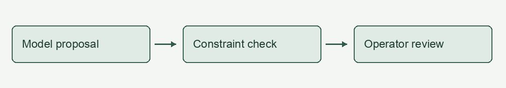

# Context-Aware Cooling: A Reading Demonstration

This is a fictional teaching document, not a published paper. All measurements below are invented to demonstrate the reader.

## 1 Introduction

A digital twin represents a physical system through a computational model. In this example, it helps compare cooling strategies before applying them to equipment.

The goal is to reduce energy use while keeping the outlet temperature below 30 °C. Lower electrical power does not always imply higher cooling efficiency.

### 1.1 Research question

Can a controller reduce pump power without violating the temperature constraint? A useful answer must consider both the energy measurement and the operating conditions.

### 1.2 How to read this example

Hover over a sentence to highlight its translation. Click the same sentence again to clear the persistent selection.

Use the paragraph menu to inspect terms, source text, and revision history. The exported HTML displays saved notes but does not save new edits.

## 2 Method

### 2.1 Model and assumptions

We assume a steady state and neglect heat loss to the surrounding room. These assumptions limit the situations in which the model can be used.

The heat-transfer relation is $Q = \dot{m} c_p \Delta T$. Here, $Q$ is the heat-transfer rate and $\Delta T$ is the temperature difference.

#### 2.1.1 Boundary conditions

The inlet temperature is fixed at 20 °C, and the heat load is 50 kW. A boundary condition describes the imposed environment, not a value predicted by the model.

### 2.2 Validation

A residual measures how strongly a candidate solution violates the governing equation. A small residual alone does not establish that the model matches real equipment.

Figure 1. The model proposes a setting, the constraint check evaluates it, and an operator decides whether to apply it.

## 3 Illustrative results

### 3.1 Energy and temperature

The baseline uses 5 kW and reaches an outlet temperature of 27 °C. The candidate uses 4 kW and reaches 29 °C under the same assumed heat load.

Pump power falls by 20%, but the temperature margin decreases from 3 °C to 1 °C. The example therefore illustrates a trade-off rather than a universally better setting.

### 3.2 Uncertainty

Sensor uncertainty and changing workloads may alter the comparison. These illustrative values are not sufficient evidence for a deployment decision.

## 4 Limitations and reading notes

This demonstration has no experimental dataset or external references. Its purpose is to show bilingual navigation, terminology, annotations, equations, and traceable revisions.

Open the optional local library to add notes or revise a translation. After reviewing those changes, export a new HTML snapshot for sharing.
